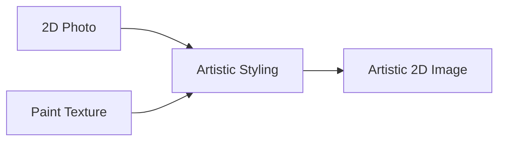

# 2D Artistic Style Transfer

Focuses on static 2D graphics, digital photography, or interface layouts.

## Core Concept
- Applies brushstrokes, oil paints, or canvas textures to 2D image coordinates.
- Preserves semantic boundaries while blending high-frequency texture details.

## Diagram

