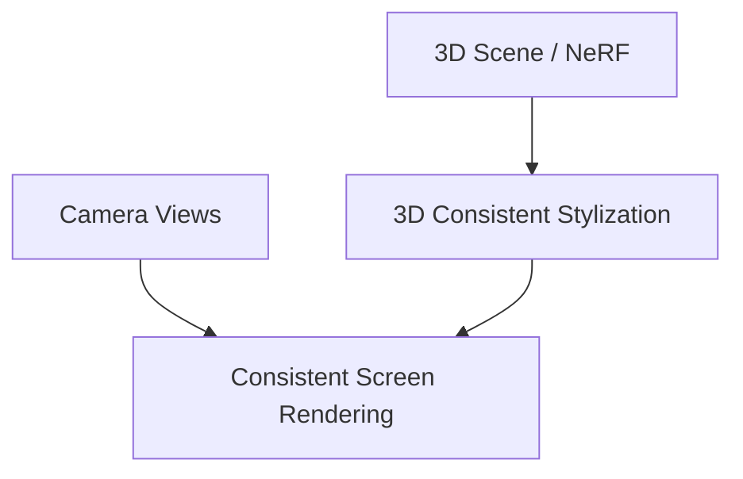

# 3D Mesh & Volumetric Scene Stylization

Enforces viewpoint consistency for stylizing 3D vertices, NeRFs, or Gaussian Splats.

## Core Concept
- Stylized textures are anchored to the 3D coordinate space rather than the screen space.
- Multi-view consistency is maintained as the virtual camera orbits.

## Diagram

