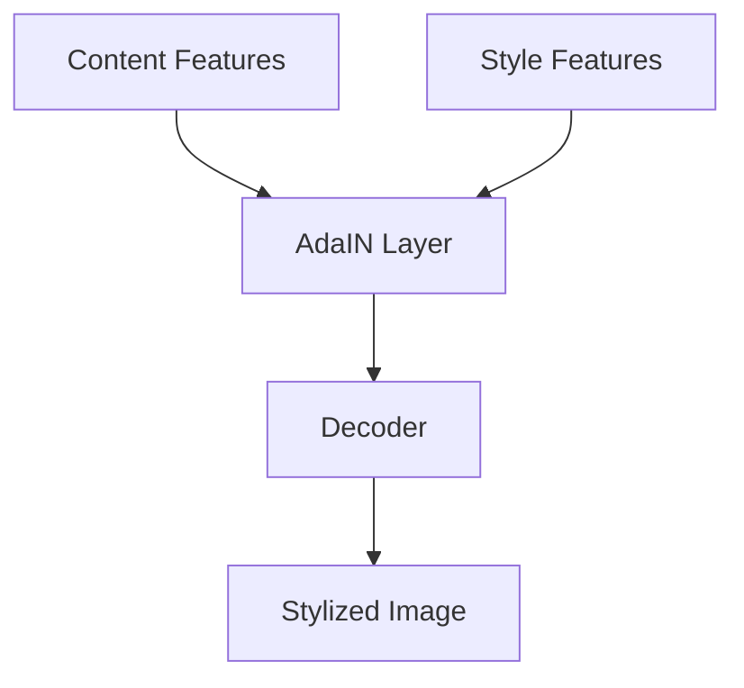

# Adaptive Instance Normalization (AdaIN)

AdaIN provides a simple and effective mechanism for arbitrary style transfer in real-time.

## Core Concept
AdaIN normalizes content activations and scales them using the mean and variance of style activations:
$$\text{AdaIN}(x, y) = \sigma(y) \left( \frac{x - \mu(x)}{\sigma(x)} \right) + \mu(y)$$

## Architecture Diagram

