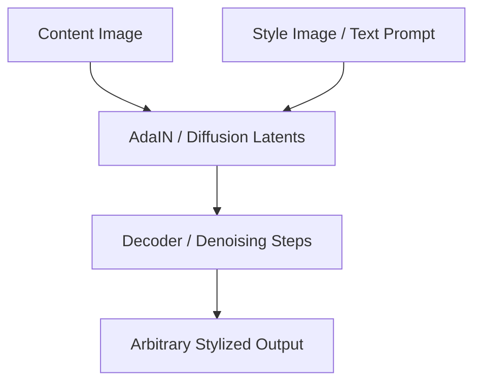

# The Arbitrary Style & Generative Diffusion Era (~2017–Present)

This era addresses the limitation of per-style networks by enabling arbitrary style transfer on-the-fly, later extending into open-vocabulary diffusion models.

## Core Concept
- **Arbitrary Style Transfer**: Methods like Adaptive Instance Normalization (AdaIN) align the statistical features of content and style layers.
- **Generative Diffusion / Flow Matching**: Modern text-to-image models use Vision-Language Models (CLIP) to guide structural diffusion denoisers based on textual style descriptions.

## Process Flowchart

