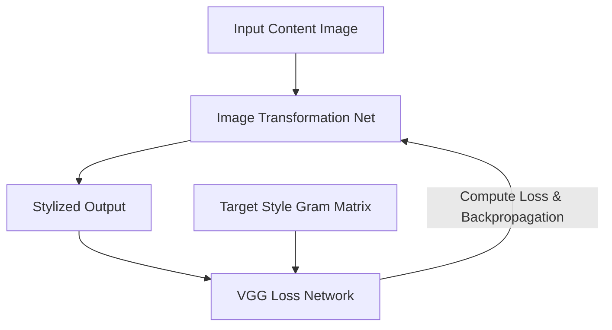

# The Fast Feed-Forward Per-Style Era (Johnson et al., 2016)

To resolve the latency issues of the optimization-based methods, Johnson et al. proposed training a feed-forward Image Transformation Network.

## Core Concept
- **Feed-Forward Transformation**: Instead of optimizing pixels, a deep residual convolutional network is trained to map a content image to its stylized version in a single forward pass.
- **Perceptual Loss**: Uses a pre-trained loss network (like VGG-19) to compute feature reconstruction and style losses during training.
- **Real-Time Speed**: Unlocked speeds of 30+ FPS, enabling video stylization, but restricted to one pre-trained style per model.

## Process Flowchart

