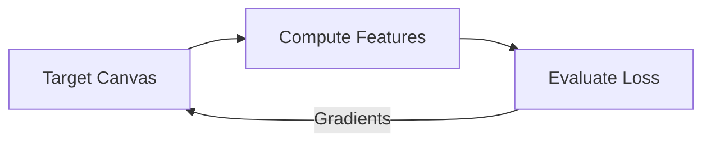

# Image-Optimized Neural Style Transfer (Instated NST)

This approach computes style transfer by directly optimizing the input image pixels via backpropagation.

## Core Concept
- **Loss Formulation**:
  $$L_{total} = \alpha L_{content} + \beta L_{style}$$
- **Gram Matrix**: Measures the second-order statistics (feature correlations) to represent style texture.
- **High Quality**: Produces highly detailed and customizable textures but is computationally expensive.

## Optimization Loop Diagram

