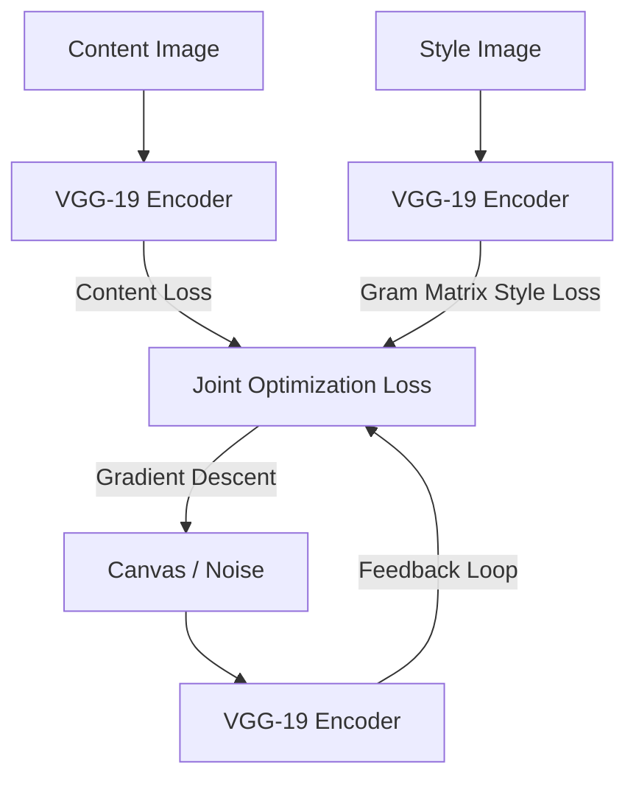

# The Neural Optimization Era (Gatys et al., 2015)

The Neural Optimization Era marks the birth of Neural Style Transfer (NST). Gatys et al. utilized a pre-trained VGG-19 network to decouple and recombine the content of one image and the style of another.

## Core Concept
- **Content Representation**: Modeled by feature activations in the deeper layers of VGG-19.
- **Style Representation**: Modeled by the **Gram Matrix**, which computes the correlations between different filter responses (channels) across multiple layers.
- **Optimization**: Gradient descent is performed directly on the pixel values of a target canvas (starting from white noise or the content image) to minimize content and style reconstruction loss.

## Process Flowchart

