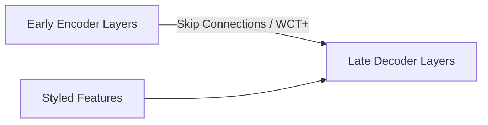

# The Outlier Blur and Feature Demolition Glitch

Addresses the loss of fine semantic structures due to over-correction of features.

## Core Concept
- **Problem**: Over-normalizing activation statistics blurs fine edges or facial features.
- **Solution**: Whitening and Coloring Transforms (WCT+) or skip-connections that feed raw spatial features to late decoders.

## Diagram

