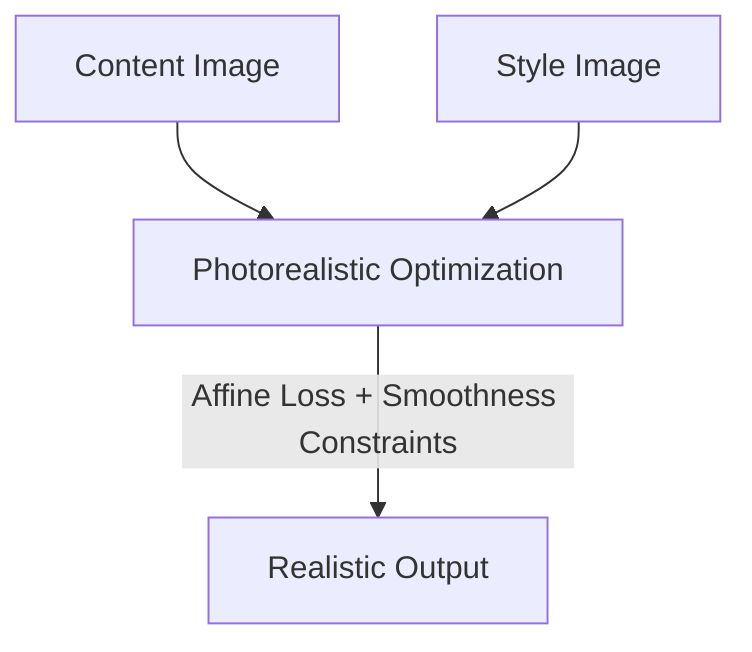

# Photorealistic Style Transfer

Photorealistic style transfer transfers style while preserving structure and preventing painterly distortions.

## Core Concept
- **Structure Preservation**: Injects photorealism regularization or local affine transforms.
- **Color Consistency**: Ensures smooth transitions and color mapping corresponding to the source target lighting.

## Architecture Diagram

