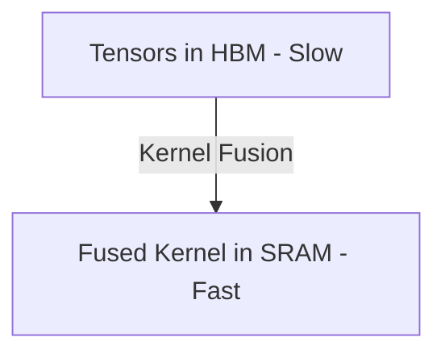

# The Real-Time HBM Caching Bottleneck

Deals with memory bandwidth bottlenecks when writing activation maps to GPU High Bandwidth Memory (HBM).

## Core Concept
- **Mitigation**: Compile transformation pipelines into Fused Triton/CUDA kernels.
- Keeps intermediate tensors within the fast on-chip GPU SRAM.

## Diagram

