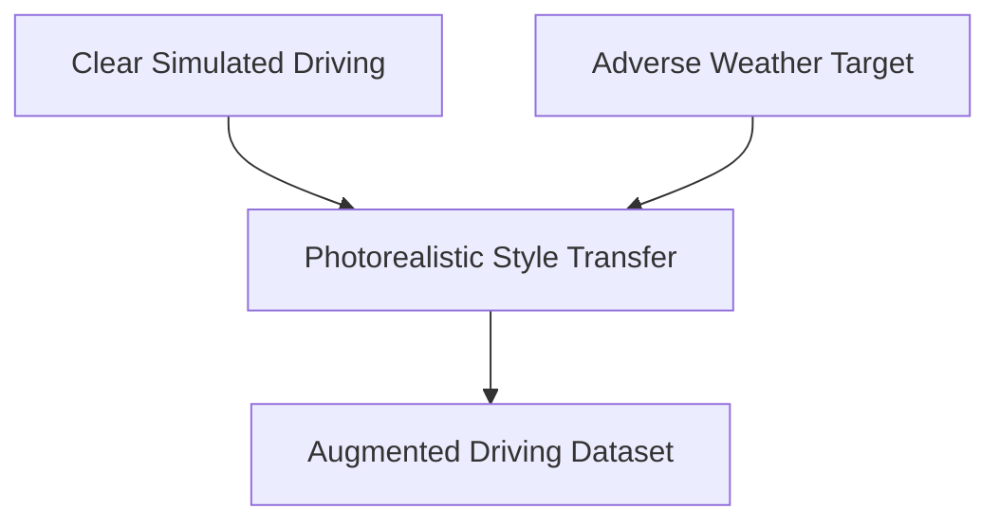

# Sim-to-Real Data Augmentation for Autonomous Safety Training

Generates diverse environmental variations (rain, glare, snow) to train self-driving cars.

## Core Concept
- Takes clean virtual simulation frames or clear daytime footage.
- Stylizes them to replicate adverse driving conditions.

## Diagram

