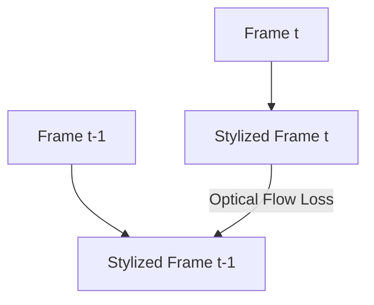

# Temporal Video Style Transfer

Applies styling to continuous video sequences while preventing temporal flickering.

## Core Concept
- **Flickering Hurdle**: Naive frame-by-frame styling results in random texture shifts.
- **Mitigation**: Optical Flow loss computes displacement vectors between frames to enforce consistency.

## Flow Diagram

