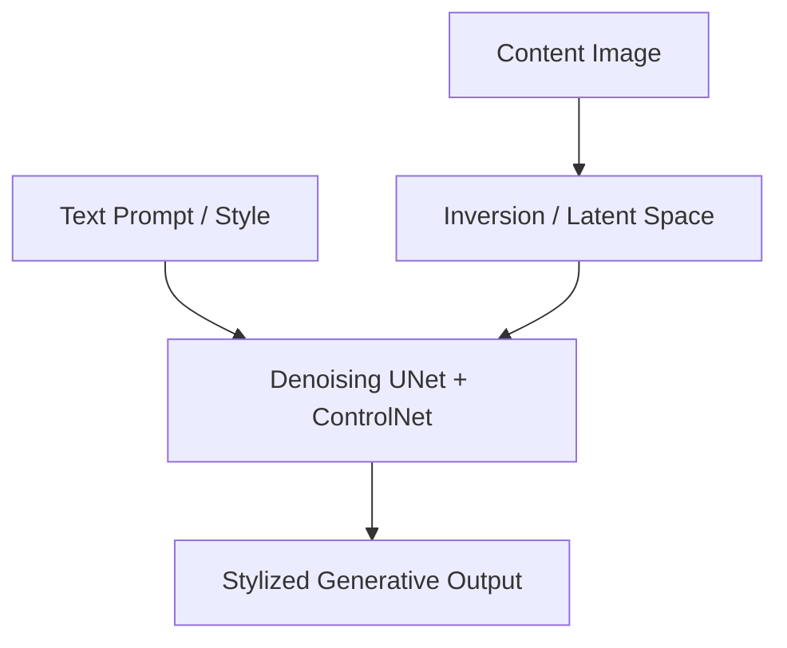

# Text-Guided Diffusion Style Transfer

Leverages diffusion models and text prompts to guide structural and stylistic editing.

## Core Concept
- **DDIM Inversion**: Inverts content images to diffusion latents.
- **ControlNet**: Injects edge/pose boundaries to maintain structural integrity during text-driven generation.

## Process Diagram

